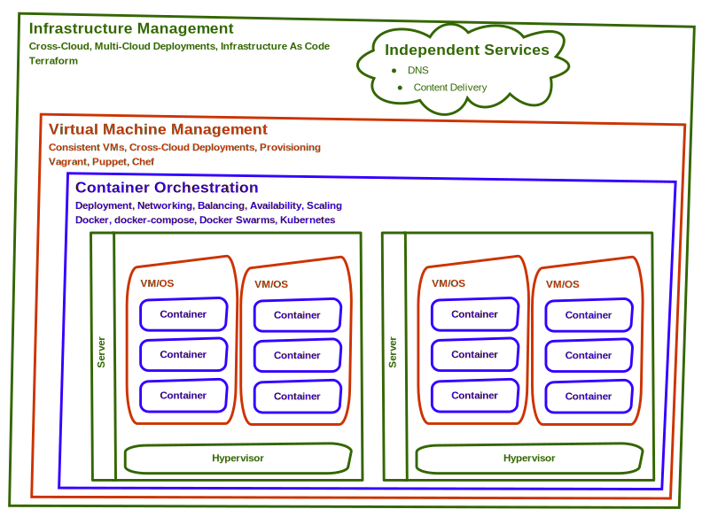
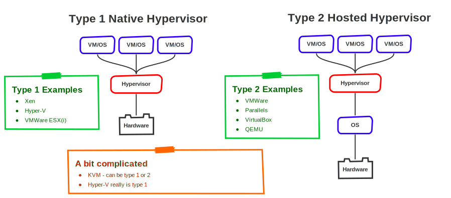
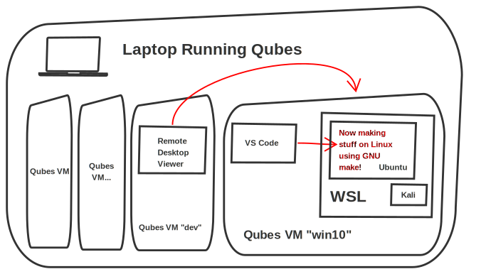

title: Extreme Containering
subtitle: ... and other virtual fun
class: animation-fade
layout: true

<!-- This slide will serve as the base layout for all your slides -->

.bottom-bar[
{{title}}
]

---

class: impact

# {{title}}

## {{subtitle}}

.title-oli[
Oliver Sturm &bull; @olivers[@fosstodon.org] &bull; oliver@oliversturm.com
]

.title-logo[]

---

## Oliver Sturm

- Training Director at DevExpress
- Consultant, trainer, author, software architect and developer for over 25 years

- Contact: oliver@oliversturm.com

---

## Agenda

- What's what - Containers, VMs and all that
- Docker
- Chromebook
- Qubes
- WSL
- Beer

---

## Containers and VMs

.svg-light[]

---

## Hypervisors

.svg-light-width[]

---

## Containers (OS-Level Virtualization)

- Origin of the idea: chroot
- Docker
- LXC/LXD
- Many others: Solaris Containers, FreeBSD jail, RKT, etc
- Based on kernel extensions that implement the required separation

---

## Docker & Co

- Docker: images, containers, volumes, network setups, swarms, etc
- Docker containers are mostly application/process centric, often ephemeral and externally updated
- Docker Hub, Amazon/Azure Container Registry
- docker-compose: container dependencies, scaling
- Kubernetes: advanced orchestration, deployment and scaling
  - Can also use container types other than Docker (CRI-O), including those that use their own hypervisors (Frakti, runV)

---

## LXC/LXD

- Linux Containers, used to be the basis of Docker functionality
- Two interfaces: `lxc-*` commands (old) and `lxc` command (new, LXD)
- Mostly long-running system containers, multi-purpose
- Sometimes stacked: cloud-hosted virtual system -> LXD container -> Kubernetes -> Inner containers
- Very common -- my phone uses LXC to run Android

---

class: impact

# DEMO

## Docker

---

## Chromebook

- Runs Chrome OS, Linux based operating system
- Chrome (duh)
- Crouton: old-style system to run Linux for devs
- Crostini: new integrated Linux based on VMs and LXC/LXD containers
- Active development efforts underway to improve integration, hardware access, etc

---

class: impact

# DEMO

## Chromebook LXC/LXD based Linux

---

## Qubes OS

- "A reasonably secure operating system"
- Hypervisor: Xen
- Everything is a VM (domain, qube)
- UI/usability integration
- Idea: isolation of technical responsibilities, user activities and data

---

class: impact

# DEMO

## Qubes OS

---

## Windows and WSL

- "Compatibility layer" provided by WSL 1, while WSL 2 uses a "real" (and customized) Linux kernel in a VM
- Runs distros of unmodified Linux binaries, similar to LXC/LXD
  - ... but using their own format, after all it's Microsoft
- Work in progress, similar to Crostini
- Pretty sucky integration compared to Crostini
- Very cool with VS Code though!
  - ... also with Visual Studio 2019, but they seem to target only C++ devs with that.

---

class: impact

# DEMO

## WSL

---

## What just happened?

.svg-light[]

---

## Sources

- This presentation:

  - https://oliversturm.github.io/extreme-containering
  - PDF download:  https://oliversturm.github.io/extreme-containering/slides.pdf

---

class: impact

# Thank You

Please feel free to contact me about the content anytime.

.title-oli[
Oliver Sturm &bull; @olivers[@fosstodon.org] &bull; oliver@oliversturm.com
]

.title-logo[

]
